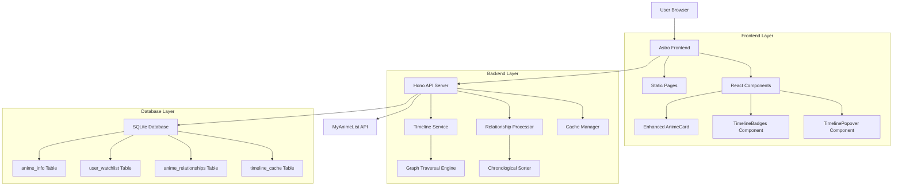
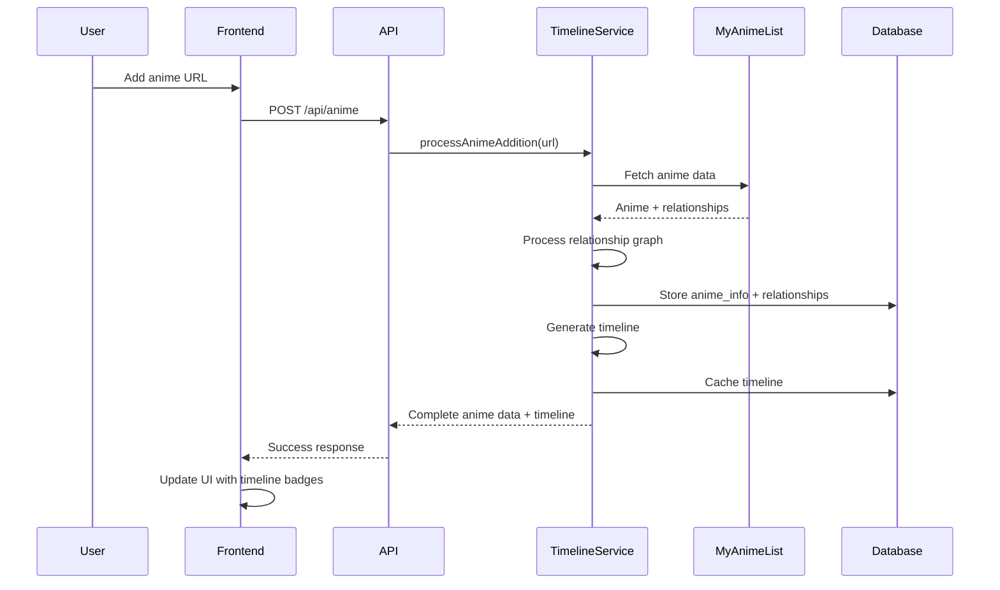

# Anime Series Timeline Design Document

## Overview

The Anime Series Timeline feature extends the existing anime watchlist application by implementing comprehensive series relationship mapping and chronological timeline visualization. This enhancement addresses the current limitation where only immediate prequels and sequels are displayed, instead providing users with complete series timelines that include all related anime entries, spin-offs, and alternative versions.

### Key Design Principles

- **Separation of Concerns**: Separate anime information storage from user watchlist preferences
- **Graph Traversal**: Recursive exploration of anime relationships to build complete series graphs
- **Chronological Ordering**: Intelligent sorting based on premiere dates, relationship types, and episode counts
- **Performance Optimization**: Caching and efficient querying to handle large relationship graphs
- **User Experience**: Intuitive timeline badges with hover details and responsive design

### Technology Stack Extensions

- **Database**: Additional tables for anime information and relationship caching
- **Graph Processing**: Custom algorithms for relationship traversal and cycle detection
- **UI Components**: Enhanced AnimeCard with timeline badge components
- **Caching**: In-memory and database caching for processed timelines

## Architecture

### Enhanced System Architecture



### Data Flow for Timeline Generation

1. User adds anime to watchlist via existing flow
2. System checks if anime exists in anime_info table
3. If not exists, fetch comprehensive data from MyAnimeList API
4. Process all related anime relationships recursively
5. Build complete relationship graph with cycle detection
6. Generate chronological timeline and cache results
7. Update AnimeCard display with timeline badges
8. Handle user interactions with timeline popovers

## Components and Interfaces

### Database Schema Changes

#### New Tables

```sql
-- Comprehensive anime information separate from user preferences
CREATE TABLE anime_info (
    id INTEGER PRIMARY KEY AUTOINCREMENT,
    mal_id INTEGER UNIQUE NOT NULL,
    title TEXT NOT NULL,
    title_english TEXT,
    title_japanese TEXT,
    image_url TEXT,
    rating REAL,
    premiere_date DATE,
    num_episodes INTEGER,
    episode_duration INTEGER, -- Duration in minutes
    anime_type TEXT, -- TV, Movie, OVA, Special, etc.
    status TEXT, -- finished_airing, currently_airing, not_yet_aired
    source TEXT, -- manga, novel, original, etc.
    studios TEXT, -- JSON array of studio names
    genres TEXT, -- JSON array of genres
    created_at DATETIME DEFAULT CURRENT_TIMESTAMP,
    updated_at DATETIME DEFAULT CURRENT_TIMESTAMP
);

-- User's personal watchlist referencing anime_info
CREATE TABLE user_watchlist (
    id INTEGER PRIMARY KEY AUTOINCREMENT,
    anime_info_id INTEGER NOT NULL,
    priority INTEGER NOT NULL,
    watch_status TEXT DEFAULT 'plan_to_watch', -- plan_to_watch, watching, completed, dropped, on_hold
    user_rating REAL,
    notes TEXT,
    created_at DATETIME DEFAULT CURRENT_TIMESTAMP,
    updated_at DATETIME DEFAULT CURRENT_TIMESTAMP,
    FOREIGN KEY (anime_info_id) REFERENCES anime_info(id)
    -- Note: No ON DELETE clause - anime_info records should never be deleted
    -- to preserve timeline relationships and cached data
);

-- Anime relationships for graph traversal
CREATE TABLE anime_relationships (
    id INTEGER PRIMARY KEY AUTOINCREMENT,
    source_mal_id INTEGER NOT NULL,
    target_mal_id INTEGER NOT NULL,
    relationship_type TEXT NOT NULL, -- sequel, prequel, side_story, alternative_version, etc.
    created_at DATETIME DEFAULT CURRENT_TIMESTAMP,
    UNIQUE(source_mal_id, target_mal_id, relationship_type),
    FOREIGN KEY (source_mal_id) REFERENCES anime_info(mal_id),
    FOREIGN KEY (target_mal_id) REFERENCES anime_info(mal_id)
);

-- Cached timeline data for performance
CREATE TABLE timeline_cache (
    id INTEGER PRIMARY KEY AUTOINCREMENT,
    root_mal_id INTEGER NOT NULL,
    timeline_data TEXT NOT NULL, -- JSON string of complete timeline
    cache_version INTEGER DEFAULT 1,
    created_at DATETIME DEFAULT CURRENT_TIMESTAMP,
    updated_at DATETIME DEFAULT CURRENT_TIMESTAMP,
    UNIQUE(root_mal_id)
);

-- Indexes for performance
CREATE INDEX idx_anime_info_mal_id ON anime_info(mal_id);
CREATE INDEX idx_user_watchlist_anime_info_id ON user_watchlist(anime_info_id);
CREATE INDEX idx_user_watchlist_priority ON user_watchlist(priority);
CREATE INDEX idx_anime_relationships_source ON anime_relationships(source_mal_id);
CREATE INDEX idx_anime_relationships_target ON anime_relationships(target_mal_id);
CREATE INDEX idx_timeline_cache_root ON timeline_cache(root_mal_id);
```

### Enhanced TypeScript Interfaces

```typescript
interface AnimeInfo {
    id: number;
    malId: number;
    title: string;
    titleEnglish: string | null;
    titleJapanese: string | null;
    imageUrl: string | null;
    rating: number | null;
    premiereDate: Date | null;
    numEpisodes: number | null;
    episodeDuration: number | null; // Duration in minutes
    animeType: AnimeType;
    status: AnimeStatus;
    source: string | null;
    studios: string[];
    genres: string[];
    createdAt: Date;
    updatedAt: Date;
}

interface UserWatchlistEntry {
    id: number;
    animeInfoId: number;
    priority: number;
    watchStatus: WatchStatus;
    userRating: number | null;
    notes: string | null;
    createdAt: Date;
    updatedAt: Date;
    animeInfo: AnimeInfo; // Joined data
}

interface AnimeRelationship {
    id: number;
    sourceMalId: number;
    targetMalId: number;
    relationshipType: RelationshipType;
    createdAt: Date;
}

interface TimelineEntry {
    malId: number;
    title: string;
    titleEnglish: string | null;
    animeType: AnimeType;
    premiereDate: Date | null;
    numEpisodes: number | null;
    episodeDuration: number | null;
    chronologicalOrder: number;
    isMainEntry: boolean; // True if this is the anime the user added
    relationshipPath: string[]; // Path of relationships from root
}

interface SeriesTimeline {
    rootMalId: number;
    entries: TimelineEntry[];
    totalEntries: number;
    mainTimelineCount: number; // Excluding side stories/alternatives
    lastUpdated: Date;
}

type AnimeType = 'unknown' | 'tv' | 'ova' | 'movie' | 'special' | 'ona' | 'music';
type AnimeStatus = 'finished_airing' | 'currently_airing' | 'not_yet_aired';
type WatchStatus = 'plan_to_watch' | 'watching' | 'completed' | 'dropped' | 'on_hold';
type RelationshipType = 'sequel' | 'prequel' | 'side_story' | 'alternative_version' | 
                       'alternative_setting' | 'parent_story' | 'spin_off' | 'adaptation' | 
                       'character' | 'summary' | 'full_story' | 'other';
```

### Backend Services

#### TimelineService

```typescript
export class TimelineService {
    private relationshipProcessor: RelationshipProcessor;
    private cacheManager: CacheManager;
    private graphTraversal: GraphTraversalEngine;

    /**
     * Get complete timeline for an anime
     */
    async getAnimeTimeline(malId: number): Promise<SeriesTimeline> {
        // Check cache first
        const cached = await this.cacheManager.getTimeline(malId);
        if (cached && !this.cacheManager.isStale(cached)) {
            return cached;
        }

        // Build timeline from scratch
        const timeline = await this.buildTimeline(malId);
        
        // Cache the result
        await this.cacheManager.setTimeline(malId, timeline);
        
        return timeline;
    }

    /**
     * Build timeline by traversing relationship graph
     */
    private async buildTimeline(rootMalId: number): Promise<SeriesTimeline> {
        // Get all related anime through graph traversal
        const relatedAnime = await this.graphTraversal.findAllRelated(rootMalId);
        
        // Sort chronologically
        const sortedEntries = await this.chronologicalSort(relatedAnime);
        
        return {
            rootMalId,
            entries: sortedEntries,
            totalEntries: sortedEntries.length,
            mainTimelineCount: sortedEntries.filter(e => e.isMainEntry).length,
            lastUpdated: new Date()
        };
    }

    /**
     * Update timeline when new relationships are discovered
     */
    async invalidateTimeline(malId: number): Promise<void> {
        await this.cacheManager.invalidateTimeline(malId);
        
        // Also invalidate related timelines
        const relatedAnime = await this.graphTraversal.findAllRelated(malId);
        for (const anime of relatedAnime) {
            await this.cacheManager.invalidateTimeline(anime.malId);
        }
    }
}
```

#### GraphTraversalEngine

```typescript
export class GraphTraversalEngine {
    /**
     * Find all anime related to the given anime through relationship traversal
     */
    async findAllRelated(rootMalId: number): Promise<AnimeInfo[]> {
        const visited = new Set<number>();
        const result = new Map<number, AnimeInfo>();
        const queue = [rootMalId];

        while (queue.length > 0) {
            const currentMalId = queue.shift()!;
            
            if (visited.has(currentMalId)) {
                continue; // Cycle detection
            }
            
            visited.add(currentMalId);
            
            // Get anime info
            const animeInfo = await this.getAnimeInfo(currentMalId);
            if (animeInfo) {
                result.set(currentMalId, animeInfo);
            }
            
            // Get all relationships
            const relationships = await this.getRelationships(currentMalId);
            
            for (const rel of relationships) {
                const targetId = rel.targetMalId;
                if (!visited.has(targetId)) {
                    queue.push(targetId);
                }
            }
        }

        return Array.from(result.values());
    }

    /**
     * Determine chronological order with intelligent sorting
     */
    async chronologicalSort(animeList: AnimeInfo[]): Promise<TimelineEntry[]> {
        // Primary sort: premiere date
        // Secondary sort: relationship type priority (main story > side story)
        // Tertiary sort: episode count (longer series first for same date)
        
        const entries: TimelineEntry[] = animeList.map((anime, index) => ({
            malId: anime.malId,
            title: anime.title,
            titleEnglish: anime.titleEnglish,
            animeType: anime.animeType,
            premiereDate: anime.premiereDate,
            numEpisodes: anime.numEpisodes,
            chronologicalOrder: index,
            isMainEntry: this.isMainTimelineEntry(anime),
            relationshipPath: [] // To be filled by relationship analysis
        }));

        return entries.sort((a, b) => {
            // Sort by premiere date first
            if (a.premiereDate && b.premiereDate) {
                const dateCompare = a.premiereDate.getTime() - b.premiereDate.getTime();
                if (dateCompare !== 0) return dateCompare;
            }
            
            // If dates are same or missing, prioritize main timeline entries
            if (a.isMainEntry !== b.isMainEntry) {
                return a.isMainEntry ? -1 : 1;
            }
            
            // Finally sort by episode count (longer first)
            const aEpisodes = a.numEpisodes || 0;
            const bEpisodes = b.numEpisodes || 0;
            return bEpisodes - aEpisodes;
        }).map((entry, index) => ({
            ...entry,
            chronologicalOrder: index + 1
        }));
    }

    private isMainTimelineEntry(anime: AnimeInfo): boolean {
        // Logic to determine if this is a main timeline entry vs side story
        const mainTypes = ['tv', 'movie'];
        return mainTypes.includes(anime.animeType);
    }
}
```

### Frontend Components

#### Enhanced AnimeCard Component

```typescript
interface EnhancedAnimeCardProps {
    watchlistEntry: UserWatchlistEntry;
    timeline: SeriesTimeline | null;
    onRemove: (id: number) => void;
    isDragging?: boolean;
}

export function EnhancedAnimeCard({ 
    watchlistEntry, 
    timeline, 
    onRemove, 
    isDragging = false 
}: EnhancedAnimeCardProps) {
    // Existing AnimeCard logic plus timeline integration
    
    return (
        <div className="anime-card">
            {/* Existing card content */}
            
            {/* Timeline Badges Section */}
            {timeline && timeline.entries.length > 1 && (
                <TimelineBadges 
                    timeline={timeline}
                    currentMalId={watchlistEntry.animeInfo.malId}
                />
            )}
        </div>
    );
}
```

#### TimelineBadges Component

```typescript
interface TimelineBadgesProps {
    timeline: SeriesTimeline;
    currentMalId: number;
}

export function TimelineBadges({ timeline, currentMalId }: TimelineBadgesProps) {
    const [hoveredEntry, setHoveredEntry] = useState<TimelineEntry | null>(null);
    
    return (
        <div className="timeline-badges-container">
            <div className="timeline-badges-scroll">
                {timeline.entries.map((entry, index) => (
                    <TimelineBadge
                        key={entry.malId}
                        entry={entry}
                        isCurrentAnime={entry.malId === currentMalId}
                        isConnected={index < timeline.entries.length - 1}
                        onHover={setHoveredEntry}
                    />
                ))}
            </div>
            
            {hoveredEntry && (
                <TimelinePopover 
                    entry={hoveredEntry}
                    onClose={() => setHoveredEntry(null)}
                />
            )}
        </div>
    );
}
```

#### TimelineBadge Component

```typescript
interface TimelineBadgeProps {
    entry: TimelineEntry;
    isCurrentAnime: boolean;
    isConnected: boolean;
    onHover: (entry: TimelineEntry | null) => void;
}

export function TimelineBadge({ 
    entry, 
    isCurrentAnime, 
    isConnected, 
    onHover 
}: TimelineBadgeProps) {
    const formatYear = (date: Date | null) => {
        return date ? date.getFullYear().toString() : '?';
    };
    
    const formatEpisodeCount = (count: number | null, duration: number | null) => {
        if (!count) return '';
        const episodeText = count === 1 ? '1ep' : `${count}ep`;
        if (duration) {
            return `${episodeText} x ${duration}min`;
        }
        return episodeText;
    };
    
    return (
        <div className="timeline-badge-wrapper">
            <div 
                className={`timeline-badge ${isCurrentAnime ? 'current' : ''}`}
                onMouseEnter={() => onHover(entry)}
                onMouseLeave={() => onHover(null)}
            >
                <div className="badge-type">{entry.animeType}</div>
                <div className="badge-year">{formatYear(entry.premiereDate)}</div>
                <div className="badge-episodes">{formatEpisodeCount(entry.numEpisodes, entry.episodeDuration)}</div>
            </div>
            
            {isConnected && (
                <div className="timeline-connector">→</div>
            )}
        </div>
    );
}
```

## Data Models

### Migration Strategy

Since the user requested the ability to completely delete the database to avoid migration complexity, the implementation will:

1. **Backup Current Data**: Export existing watchlist data before schema changes
2. **Drop and Recreate**: Implement fresh schema with new table structure
3. **Data Migration**: Re-import watchlist data into new structure
4. **Timeline Population**: Fetch and process timeline data for existing anime

### Data Retention Strategy

The system will maintain all discovered anime information permanently in the `anime_info` table to support timeline relationships:

1. **Persistent Anime Cache**: Once an anime is discovered through relationship traversal, it remains in `anime_info` indefinitely
2. **Safe Watchlist Removal**: Removing anime from user watchlist only deletes the `user_watchlist` entry, not the underlying `anime_info`
3. **Relationship Preservation**: All anime relationships remain intact even when anime are removed from personal watchlists
4. **Timeline Integrity**: This ensures timelines remain complete and accurate for all remaining watchlist entries
5. **Storage Optimization**: Implement periodic cleanup of truly orphaned anime (no relationships and not in any watchlist) if storage becomes a concern
6. **No Anime Deletion**: The system will not provide functionality to delete from `anime_info` table to prevent breaking timeline relationships

### Data Processing Pipeline



## Error Handling

### Timeline-Specific Error Handling

#### Graph Traversal Errors
- **Circular Dependencies**: Detect and break cycles while preserving valid relationships
- **Missing Relationships**: Handle incomplete relationship data gracefully
- **API Failures**: Retry with exponential backoff, use cached data when available

#### Timeline Generation Errors
- **Date Parsing Issues**: Handle malformed or missing premiere dates
- **Relationship Conflicts**: Resolve conflicting relationship information
- **Cache Corruption**: Detect and rebuild corrupted timeline caches

#### UI Error States
- **Timeline Loading**: Show skeleton badges while timeline loads
- **Timeline Errors**: Display simplified timeline or fallback to original series info
- **Popover Failures**: Graceful degradation when detailed information unavailable

### Error Response Extensions

```typescript
interface TimelineErrorResponse extends ErrorResponse {
    timelineStatus?: 'loading' | 'partial' | 'failed' | 'unavailable';
    fallbackData?: {
        hasSequels: boolean;
        hasPrequels: boolean;
        estimatedSeriesCount: number;
    };
}
```

## Testing Strategy

### Timeline-Specific Testing

#### Unit Tests
- **Graph Traversal**: Test cycle detection, relationship processing
- **Chronological Sorting**: Test various date and relationship scenarios
- **Cache Management**: Test cache invalidation and refresh logic

#### Integration Tests
- **Timeline Generation**: Test complete pipeline from anime addition to timeline display
- **Database Operations**: Test new schema operations and data integrity
- **API Integration**: Test MyAnimeList relationship data processing

#### Performance Tests
- **Large Series**: Test with complex series like Gundam or Fate franchises
- **Cache Performance**: Measure timeline generation and cache hit rates
- **UI Responsiveness**: Test timeline badge rendering with many entries

### Test Data Scenarios

```typescript
// Test cases for complex anime relationships
const testScenarios = [
    {
        name: 'Linear Series',
        example: 'Attack on Titan (Season 1 → 2 → 3 → 4)',
        expectedBehavior: 'Simple chronological ordering'
    },
    {
        name: 'Branching Timeline',
        example: 'Fate series (multiple routes and spin-offs)',
        expectedBehavior: 'Parallel timelines with clear separation'
    },
    {
        name: 'Circular References',
        example: 'Series with mutual references',
        expectedBehavior: 'Cycle detection and resolution'
    },
    {
        name: 'Mixed Media',
        example: 'TV + Movies + OVAs + Specials',
        expectedBehavior: 'Proper type-based sorting'
    }
];
```

## Performance Considerations

### Optimization Strategies

#### Database Optimization
- **Relationship Indexing**: Optimize queries for graph traversal
- **Timeline Caching**: Cache processed timelines to avoid repeated computation
- **Batch Processing**: Process multiple anime relationships in batches

#### Frontend Optimization
- **Lazy Loading**: Load timeline data only when needed
- **Virtual Scrolling**: Handle large timelines efficiently
- **Component Memoization**: Prevent unnecessary re-renders of timeline badges

#### API Optimization
- **Request Batching**: Batch MyAnimeList API requests when possible
- **Intelligent Caching**: Cache relationship data with appropriate TTL
- **Background Processing**: Process timelines asynchronously when possible

### Scalability Considerations

- **Timeline Complexity**: Handle series with 50+ related entries
- **Concurrent Users**: Support multiple users generating timelines simultaneously
- **Cache Management**: Implement cache eviction policies for memory management
- **Database Growth**: Plan for growth in anime_info and relationships tables