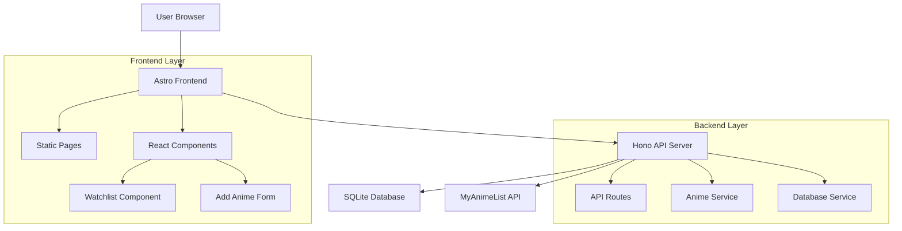

# Project Claw Design Document

## Overview

Project Claw is a full-stack Node.js application that combines a modern frontend built with Astro and React components with a lightweight Hono API backend. The application uses SQLite for local data persistence and integrates with the MyAnimeList API to automatically fetch anime information from user-provided URLs.

### Technology Stack

- **Frontend**: Astro with React components for interactive features
- **Backend**: Hono (lightweight, fast web framework)
- **Database**: SQLite with Drizzle ORM
- **API Integration**: MyAnimeList API v2
- **Drag & Drop**: @dnd-kit/core for React components
- **Styling**: Tailwind CSS for responsive design

## Architecture

### System Architecture



### Application Flow

1. User submits MyAnimeList URL through frontend form
2. Frontend sends POST request to Hono API
3. API extracts anime ID from URL and fetches data from MyAnimeList
4. API stores anime data in SQLite database
5. Frontend updates to display new anime in watchlist
6. User can drag-and-drop to reorder, triggering priority updates

## Components and Interfaces

### Frontend Components

#### WatchlistApp (React Component)
- **Purpose**: Main container for the watchlist functionality
- **Props**: Initial anime data from Astro page
- **State**: Current anime list, loading states, error states
- **Features**: Drag-and-drop reordering, add/remove anime

#### AnimeCard (React Component)
- **Purpose**: Display individual anime with comprehensive details
- **Props**: Anime data object, drag handlers, remove callback
- **Features**: 
  - Image, title (both English and Japanese), rating display
  - Premiere date and episode count
  - Series information badge (e.g., "Season 2 of 4")
  - Hover effects, remove button, drag handle

#### AddAnimeForm (React Component)
- **Purpose**: Form for adding new anime via MyAnimeList URL
- **State**: URL input, validation, submission status
- **Features**: URL validation, error display, loading states

### Backend API Endpoints

#### GET /api/anime
- **Purpose**: Retrieve all anime in priority order
- **Response**: Array of anime objects with priority ordering
- **Error Handling**: Database connection errors

#### POST /api/anime
- **Purpose**: Add new anime from MyAnimeList URL
- **Body**: `{ url: string }`
- **Process**: Extract ID → Fetch from MAL → Store in DB
- **Response**: Created anime object or error details

#### PUT /api/anime/reorder
- **Purpose**: Update priority order of anime list
- **Body**: `{ animeIds: number[] }` (in new order)
- **Process**: Update priority values in database
- **Response**: Success confirmation

#### DELETE /api/anime/:id
- **Purpose**: Remove anime from watchlist
- **Process**: Delete from database, adjust priorities
- **Response**: Success confirmation

### MyAnimeList Integration

#### URL Parsing
- **Pattern**: `https://myanimelist.net/anime/{id}/{title-slug}`
- **Extraction**: Use regex to extract numeric ID
- **Validation**: Verify URL format before processing

#### API Integration
- **Endpoint**: `https://api.myanimelist.net/v2/anime/{id}`
- **Fields**: `title`, `alternative_titles`, `main_picture`, `mean` (rating), `start_date`, `num_episodes`, `related_anime`
- **Authentication**: Client credentials flow
- **Rate Limiting**: Implement request queuing and retry logic

#### Series Relationship Processing
- **Detection**: Use `related_anime` field to identify sequels, prequels, and related series
- **Analysis**: Process relation types ("sequel", "prequel", "side_story", "alternative_version")
- **Counting**: Calculate total series count and current position in chronological order
- **Display**: Generate user-friendly series information (e.g., "Season 2 of 4", "Part 1 of 3")
- **Caching**: Store processed series information to avoid repeated API calls

## Data Models

### Anime Table Schema

```sql
CREATE TABLE anime (
    id INTEGER PRIMARY KEY AUTOINCREMENT,
    mal_id INTEGER UNIQUE NOT NULL,
    title TEXT NOT NULL,
    title_english TEXT,
    title_japanese TEXT,
    image_url TEXT,
    rating REAL,
    premiere_date DATE,
    num_episodes INTEGER,
    series_info TEXT, -- JSON string with related series data
    priority INTEGER NOT NULL,
    created_at DATETIME DEFAULT CURRENT_TIMESTAMP,
    updated_at DATETIME DEFAULT CURRENT_TIMESTAMP
);

CREATE INDEX idx_anime_priority ON anime(priority);
CREATE INDEX idx_anime_mal_id ON anime(mal_id);
```

### TypeScript Interfaces

```typescript
interface Anime {
    id: number;
    malId: number;
    title: string;
    titleEnglish: string | null;
    titleJapanese: string | null;
    imageUrl: string | null;
    rating: number | null;
    premiereDate: Date | null;
    numEpisodes: number | null;
    seriesInfo: SeriesInfo | null;
    priority: number;
    createdAt: Date;
    updatedAt: Date;
}

interface SeriesInfo {
    totalSeries: number;
    currentPosition: number;
    hasSequels: boolean;
    hasPrequels: boolean;
    relatedTitles: string[];
}

interface AddAnimeRequest {
    url: string;
}

interface ReorderRequest {
    animeIds: number[];
}

interface MyAnimeListResponse {
    id: number;
    title: string;
    alternative_titles?: {
        en?: string;
        ja?: string;
    };
    main_picture?: {
        medium: string;
        large: string;
    };
    mean?: number;
    start_date?: string;
    num_episodes?: number;
    related_anime?: Array<{
        node: {
            id: number;
            title: string;
        };
        relation_type: string;
    }>;
}
```

## Error Handling

### Frontend Error Handling
- **Network Errors**: Display retry buttons and error messages
- **Validation Errors**: Show inline form validation
- **Loading States**: Skeleton loaders and progress indicators
- **Empty States**: Helpful messages when watchlist is empty

### Backend Error Handling
- **MyAnimeList API Errors**: 
  - Rate limiting: Queue requests and inform user
  - Invalid URLs: Return 400 with helpful message
  - API unavailable: Return 503 with retry suggestion
- **Database Errors**:
  - Connection issues: Return 500 with maintenance message
  - Constraint violations: Return 409 for duplicates
- **Input Validation**:
  - Invalid URLs: Return 400 with format requirements
  - Missing data: Return 422 with field requirements

### Error Response Format
```typescript
interface ErrorResponse {
    error: string;
    message: string;
    code?: string;
    details?: any;
}
```

## Testing Strategy

### Frontend Testing
- **Unit Tests**: Jest + React Testing Library for components
- **Integration Tests**: Test API integration and user flows
- **E2E Tests**: Playwright for drag-and-drop and full workflows
- **Visual Tests**: Screenshot testing for UI consistency

### Backend Testing
- **Unit Tests**: Test individual services and utilities
- **Integration Tests**: Test API endpoints with test database
- **API Tests**: Test MyAnimeList integration with mocked responses
- **Database Tests**: Test schema migrations and data integrity

### Test Data Management
- **Fixtures**: Sample anime data for consistent testing
- **Mocks**: MyAnimeList API responses for offline testing
- **Test Database**: Separate SQLite file for test isolation

### Performance Considerations
- **Database Indexing**: Priority and MAL ID indexes for fast queries
- **API Caching**: Cache MyAnimeList responses to reduce API calls
- **Image Loading**: Lazy loading for anime cover images
- **Bundle Optimization**: Code splitting for React components