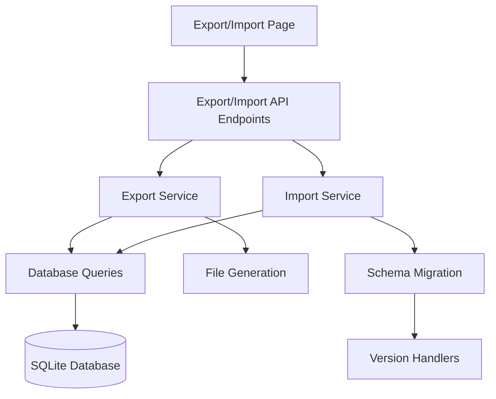

# Design Document

## Overview

The Data Export/Import feature provides users with comprehensive backup and migration capabilities for their anime database. The system will create versioned JSON export files containing all database tables and provide robust import functionality with schema migration support. The feature integrates seamlessly with the existing Astro + React + Hono architecture.

## Architecture

### High-Level Architecture



### Technology Stack Integration

- **Frontend**: Astro page with React components for UI interactions
- **Backend**: Hono API endpoints for export/import operations
- **Database**: Existing Drizzle ORM with SQLite
- **File Format**: JSON with schema versioning
- **Validation**: Zod schemas for data validation

## Components and Interfaces

### 1. Frontend Components

#### ExportImportPage (Astro Page)
- **Location**: `src/pages/export-import.astro`
- **Purpose**: Main page container with layout and initial data
- **Responsibilities**:
  - Render page layout using existing Layout.astro
  - Provide initial database statistics
  - Handle client-side routing

#### ExportImportManager (React Component)
- **Location**: `src/components/ExportImportManager.tsx`
- **Purpose**: Main interactive component for export/import operations
- **Props**:
  ```typescript
  interface ExportImportManagerProps {
    initialStats: DatabaseStats;
  }
  ```
- **State Management**:
  - Export/import progress
  - Error handling
  - File upload state
  - Operation mode (export/import)

#### ExportSection (React Component)
- **Location**: `src/components/ExportSection.tsx`
- **Purpose**: Handles export functionality
- **Features**:
  - Export button with loading state
  - Database statistics display
  - Download progress indicator

#### ImportSection (React Component)
- **Location**: `src/components/ImportSection.tsx`
- **Purpose**: Handles import functionality
- **Features**:
  - File upload area (drag & drop)
  - Import preview
  - Merge/replace options
  - Progress indicator

### 2. Backend Services

#### Export Service
- **Location**: `src/api/services/export-service.ts`
- **Purpose**: Generate export files with all database data
- **Key Methods**:
  ```typescript
  class ExportService {
    async exportAllData(): Promise<ExportData>
    async generateExportFile(): Promise<Buffer>
    private validateDataIntegrity(data: ExportData): boolean
  }
  ```

#### Import Service
- **Location**: `src/api/services/import-service.ts`
- **Purpose**: Process import files and handle data insertion
- **Key Methods**:
  ```typescript
  class ImportService {
    async validateImportFile(file: Buffer): Promise<ValidationResult>
    async previewImport(data: ExportData): Promise<ImportPreview>
    async executeImport(data: ExportData, options: ImportOptions): Promise<ImportResult>
    private handleSchemaMigration(data: ExportData): Promise<ExportData>
  }
  ```

#### Schema Migration Service
- **Location**: `src/api/services/schema-migration-service.ts`
- **Purpose**: Handle backward compatibility for different export versions
- **Key Methods**:
  ```typescript
  class SchemaMigrationService {
    async migrateToCurrentVersion(data: ExportData): Promise<ExportData>
    private getVersionHandlers(): Map<string, VersionHandler>
  }
  ```

### 3. API Endpoints

#### Export Endpoints
- **GET** `/api/export/stats` - Get database statistics
- **POST** `/api/export/generate` - Generate and download export file

#### Import Endpoints
- **POST** `/api/import/validate` - Validate uploaded file
- **POST** `/api/import/preview` - Preview import data
- **POST** `/api/import/execute` - Execute import operation

## Data Models

### Export Data Format

```typescript
interface ExportData {
  metadata: ExportMetadata;
  data: {
    animeInfo: AnimeInfo[];
    userWatchlist: UserWatchlistEntry[];
    animeRelationships: AnimeRelationship[];
    timelineCache: TimelineCache[];
  };
}

interface ExportMetadata {
  version: string; // Schema version (e.g., "1.0.0")
  exportDate: string; // ISO timestamp
  totalRecords: number;
  checksum: string; // Data integrity verification
  application: {
    name: string;
    version: string;
  };
}
```

### Import Options

```typescript
interface ImportOptions {
  mode: 'merge' | 'replace';
  handleDuplicates: 'skip' | 'update' | 'prompt';
  validateRelationships: boolean;
  clearCache: boolean;
}

interface ImportResult {
  success: boolean;
  recordsProcessed: {
    animeInfo: number;
    userWatchlist: number;
    animeRelationships: number;
    timelineCache: number;
  };
  errors: ImportError[];
  warnings: ImportWarning[];
}
```

### Schema Versioning

```typescript
interface VersionHandler {
  version: string;
  migrate(data: any): Promise<ExportData>;
  validate(data: any): boolean;
}

// Current version: "1.0.0"
// Future versions: "1.1.0", "2.0.0", etc.
```

## Error Handling

### Export Error Scenarios
1. **Database Connection Failure**: Retry mechanism with exponential backoff
2. **Data Integrity Issues**: Validation before export, detailed error reporting
3. **File Generation Failure**: Temporary file cleanup, user notification
4. **Large Dataset Handling**: Streaming export for memory efficiency

### Import Error Scenarios
1. **Invalid File Format**: Clear validation messages with specific issues
2. **Schema Version Mismatch**: Automatic migration or clear upgrade instructions
3. **Data Corruption**: Checksum validation, rollback on failure
4. **Foreign Key Violations**: Detailed relationship validation, partial import options
5. **Duplicate Handling**: User choice for conflict resolution

### Error Response Format

```typescript
interface ApiError {
  code: string;
  message: string;
  details?: any;
  timestamp: string;
}

// Example error codes:
// EXPORT_DATABASE_ERROR
// EXPORT_VALIDATION_FAILED
// IMPORT_INVALID_FORMAT
// IMPORT_SCHEMA_MISMATCH
// IMPORT_DATA_CORRUPTION
```

## Testing Strategy

### Unit Tests
- **Export Service**: Data extraction, file generation, validation
- **Import Service**: File parsing, data validation, insertion logic
- **Schema Migration**: Version handling, data transformation
- **API Endpoints**: Request/response handling, error scenarios

### Integration Tests
- **Full Export/Import Cycle**: Export data, import to clean database, verify integrity
- **Schema Migration**: Test migration from older versions to current
- **Error Handling**: Database failures, corrupted files, network issues
- **Large Dataset Handling**: Performance testing with substantial data

### Component Tests
- **React Components**: User interactions, file upload, progress display
- **API Integration**: Frontend-backend communication, error handling
- **Accessibility**: Screen reader compatibility, keyboard navigation

### Test Data Scenarios
1. **Empty Database**: Export/import with no data
2. **Small Dataset**: Basic functionality testing
3. **Large Dataset**: Performance and memory testing
4. **Complex Relationships**: Timeline data with multiple connections
5. **Corrupted Data**: Error handling and recovery

## Performance Considerations

### Export Performance
- **Streaming**: Large datasets exported in chunks to avoid memory issues
- **Compression**: Optional gzip compression for large files
- **Progress Tracking**: Real-time progress updates for user feedback
- **Background Processing**: Non-blocking export operations

### Import Performance
- **Batch Processing**: Insert data in optimized batches
- **Transaction Management**: Rollback capability for failed imports
- **Memory Management**: Process large files without loading entirely into memory
- **Progress Indicators**: Detailed progress for long-running operations

### Database Optimization
- **Index Usage**: Leverage existing indexes for efficient queries
- **Connection Pooling**: Reuse database connections
- **Query Optimization**: Minimize database round trips
- **Cache Invalidation**: Clear relevant caches after import

## Security Considerations

### File Upload Security
- **File Type Validation**: Only accept JSON files
- **File Size Limits**: Prevent extremely large uploads
- **Content Validation**: Strict schema validation before processing
- **Temporary File Handling**: Secure cleanup of uploaded files

### Data Integrity
- **Checksum Verification**: Validate data integrity during import
- **Schema Validation**: Ensure imported data matches expected structure
- **Sanitization**: Clean imported data to prevent injection attacks
- **Backup Strategy**: Automatic backup before destructive operations

### Access Control
- **Rate Limiting**: Prevent abuse of export/import endpoints
- **Authentication**: Future-ready for user authentication
- **Audit Logging**: Track export/import operations for security monitoring

## Navigation Integration

### Header Navigation Update
Add "Data Management" link to the existing navigation in `src/layouts/Layout.astro`:

```html
<nav class="hidden sm:flex items-center space-x-4">
  <a href="/">Watchlist</a>
  <a href="/export-import">Data Management</a>
  <a href="/about">About</a>
</nav>
```

### Mobile Navigation
Include the new page in mobile menu for consistent navigation experience.

## Future Extensibility

### Planned Enhancements
1. **Scheduled Exports**: Automatic backup generation
2. **Cloud Storage Integration**: Direct export to cloud services
3. **Selective Export**: Export specific data subsets
4. **Import Validation UI**: Advanced conflict resolution interface
5. **Export Templates**: Predefined export configurations

### Schema Evolution Strategy
- **Semantic Versioning**: Clear version numbering for schema changes
- **Migration Path**: Documented upgrade procedures
- **Backward Compatibility**: Support for older export formats
- **Forward Compatibility**: Extensible schema design

This design provides a robust foundation for the data export/import feature while maintaining consistency with the existing codebase architecture and ensuring scalability for future enhancements.